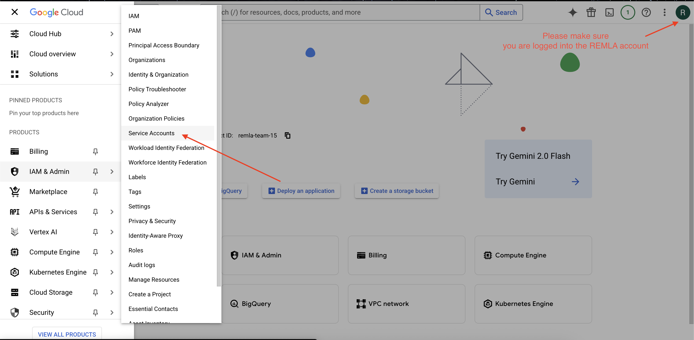
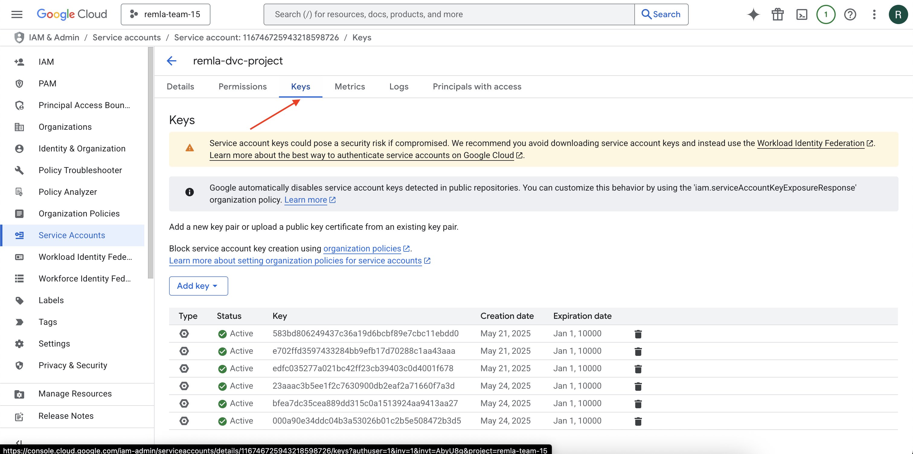

# Restaurant Sentiment Analysis – Model Training

<!-- AUTOMATED-BADGES -->


<!-- END-AUTOMATED-BADGES -->

This repository contains the code to train a sentiment analysis model on restaurant reviews using a machine learning pipeline.
It includes Docker support for reproducibility and a GitHub Actions workflow to automate training and artifact generation.

---

## Features

- Trains a sentiment analysis model on TSV datasets
- Uses `nltk`, `sklearn`
- Dockerized
- GitHub Actions workflow to automate model training and upload artifacts

---

# Getting started

You need to have an API key to access the DVC remote. A4 reviewers can find a temporary API key `sa_key.json` on the peer platform. Please copy
the JSON file to a `secrets/` folder at the root of this repo.

Reviewers should confirm that the `.dvc/config` looks like this:

```vim
[core]
    analytics = false
    remote = myremote
['remote "myremote"']
    url = gdrive://1bxRbOXRah2lb_E8Ec6X6yDO9vYUj5OFT
    gdrive_client_id = 25021044702-g9nrb5d0gbo0dv8r9hokphh26jnk5hn0.apps.googleusercontent.com
    gdrive_client_secret = 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
    gdrive_use_service_account = true
    gdrive_service_account_json_file_path = ../secrets/sa_key.json
```

You can jump to the [Training](#training) section directly.

#### For Team 15 members, please see the section about "Setting up service account key" below.

Other people can also follow a similar process but with their own service account. This part assumes that you already have a service account
created on Google Cloud. Refer the DVC docs for creating it [here](https://dvc.org/doc/user-guide/data-management/remote-storage/google-drive#using-service-accounts).

## Setting up service account key

**For team 15 members only.**

We use Google Drive as DVC remote, specifically the [remla_resources](https://drive.google.com/drive/folders/1bxRbOXRah2lb_E8Ec6X6yDO9vYUj5OFT?usp=sharing) folder.

You need to be logged in to the remlateam15 google account to access this directly.

This should already be present in our `.dvc/config` but if it isn't, you can add the remote storage to your dvc config using:

```zsh
dvc remote add myremote gdrive://1bxRbOXRah2lb_E8Ec6X6yDO9vYUj5OFT
```

Set this remote as your default remote for future push and pull operations: (again, this should already be present in the config)

```zsh
dvc remote default myremote
```

To access the remote storage using dvc, you need to set up an API key. Our preferred way of doing this
is using a service account.

We already have a service account called "remla-dvc-project" created on our Google Cloud project called "remla-team-15". Please login to the
common remlateam15@gmail.com account and check it out on the Google Cloud console dashboard [https://console.cloud.google.com/](https://console.cloud.google.com/).

You **DO NOT** need to create a new service account, you only need to add a new key for yourselves.
Please read the docs and only follow the part from "Select your service account and go to the Keys tab..."

You can read the DVC docs [here](https://dvc.org/doc/user-guide/data-management/remote-storage/google-drive#using-service-accounts)

### TL;DR

Go to the remlateam15 google cloud dashboard, from the hamburger menu on the top left, navigate to IAM & ADMIN and then to Service Accounts.


Click on the service account name "remla-dvc-project@remla-team-15.iam.gserviceaccount.com" to open it and navigate to "Keys"



Click on Add key and create a new JSON key.
After you create the key, you can download it to `secrets/sa_key.json` (you may
need to create a new folder called `secrets/` at the root of this project.)

Make sure you have the file at that location.

You should also add the key to your dvc config: (it might already be present in `.dvc/config`

```zsh
dvc remote modify myremote gdrive_service_account_json_file_path secrets/sa_key.json
```

The `secrets/` folder doesn't get pushed to GitHub.

If everything went correctly, you should be able to pull from dvc remote using:

```zsh
dvc pull
```

---

## Linting (TODO)

For now, there is a non-trivial pylintrc file but it needs to be improved to catch ML Specific code smells (refer Assignment 4 Code Quality excellent section).

You can run pylint right now:

```zsh
pylint src/
```

We also need to add more linters like flake8 and Bandit.

---

## Testing
There are some tests in the `tests/` directory following the ML Test Score methodology.
You can run the tests using:

```bash
pytest tests/
```
You can also run the tests with coverage:

```bash
pytest --cov=src tests/
```

Check cyclomatic complexity
```bash
radon cc src/ -s -a
```

--

## Testing
There are some tests in the `tests/` directory following the ML Test Score methodology.
You can run the tests using:

```bash
pytest tests/
```
You can also run the tests with coverage:

```bash
pytest --cov=src tests/
```

Check cyclomatic complexity
```bash
radon cc src/ -s -a
```

--

# Training

Before proceeding with training, please make sure you have the API key in the correct location, i.e. `secrets/sa_key.json`.
You can either run the training locally or using a docker container. Skip to [Training with docker](#training-with-docker) to do it in docker.

## Training Locally

### 1. Install Dependencies

The project works with Python 3.10.

You can create a virtual environment and use that for running the project. Please read the
docs if you're unfamiliar with these [https://docs.python.org/3/library/venv.html](https://docs.python.org/3/library/venv.html).

For Linux/Mac users:

```bash
python3 -m venv venv
source venv/bin/activate
```

For Windows users:

```powershell
python -m venv venv
venv\Scripts\activate
```

You can install the project dependencies using the following commands:

```bash
pip install -r requirements-dev.txt
pip install -r requirements.txt # Redundant if you install requirements-dev.txt
```

### 2. Run the DVC pipeline

Pull from dvc remote to get the latest experiments

```bash
dvc pull
```

Run the pipeline

```bash
dvc repro
```

## Running experiments with DVC

We use **DVC experiments** to manage and track machine learning experiments.

To run the pipeline and capture experimental results, use:

```zsh
dvc exp run
```

This command executes the pipeline defined in `dvc.yaml` using the parameters from `params.yaml`.
It tracks outputs, metrics, and changes, letting you iterate quickly without committing to Git every time.

To view and compare experiments:

```zsh
dvc exp show
```

You can modify hyperparameters in `params.yaml` and rerun `dvc exp run` to test different configurations.
DVC will log each run as a separate experiment that you can compare and manage.

You can also do this through the CLI:

```zsh
dvc exp run -S train.random_state=45
```

## Pushing to remote

If you have everything setup correctly, you should also be able to push to the remote storage by running:

```zsh
dvc push
```

---

## Training with Docker

You can also train the model using a Docker container, which encapsulates all dependencies and avoids needing a local Python setup.

### 1. Build the Docker Image

This will build a Docker image with Python 3.10 and all project dependencies installed.

```bash
docker build -t model-trainer .
```

### 2. Pull from DVC Remote

Before running the training pipeline, ensure the latest data and artifacts are pulled from the DVC remote:

```bash
docker run --rm -v $(pwd):/app \
  -e DVC_GDRIVE_SERVICE_ACCOUNT_JSON_FILE_PATH=/app/secrets/sa_key.json \
  model-trainer
```

### 3. Run the DVC Pipeline

To run the pipeline inside the container:

```bash
docker run --rm -v $(pwd):/app model-trainer dvc repro
```

This will generate trained models and save them in the output/ directory.

## Running Experiments with Docker

You can also run DVC experiments inside the Docker container:

```bash
docker run --rm -v $(pwd):/app model-trainer dvc exp run
```

To view experiment results:

```bash
docker run --rm -v $(pwd):/app model-trainer dvc exp show
```

To run with updated parameters:

```bash
docker run --rm -v $(pwd):/app model-trainer dvc exp run -S train.random_state=45
```

## Pushing to DVC Remote with Docker

After generating or modifying outputs, push to your remote DVC storage:

```bash
docker run --rm -v $(pwd):/app model-trainer dvc push
```

## Output

After successful training, the following files are saved in the `output/` directory:

- `c1_BoW_Sentiment_Model.pkl`: Trained CountVectorizer BoW model
- `c2_Classifier_Sentiment_Model.pkl`: Trained classifier model

---

## GitHub Actions

This project includes two GitHub Actions workflows for automating training and releasing machine learning models:

`.github/workflows/train.yml`

Triggered on push or pull_request to the main branch:

- Checks out the codebase
- Sets up Python 3.10
- Installs project dependencies
- Configures Google Drive service account for DVC access
- Pulls required data from the DVC remote
- Reproduces the DVC pipeline to train the model
- Uploads evaluation metrics (`metrics/eval.json`) as a GitHub Actions artifact
- Uploads trained model files (`output/` directory) as a GitHub Actions artifact

`/github/workflows/release.yml`

Triggered on pushing a Git tag matching the format vX.Y.Z (e.g., v1.0.0):

- Checks out the repository at the tagged commit
- Sets up Python and the Google Drive service account
- Pulls required data from the DVC remote
- Reproduces the DVC pipeline to retrain the model
- Pushes updated data and model outputs to the DVC remote
- Uploads the trained model files to a versioned Google Drive folder
- Creates a GitHub Release with the tag
- Attaches trained model files as downloadable assets to the GitHub Release

## Dependencies

Dependencies are defined in `requirements.txt` and installed inside the Docker image automatically during the build process.
